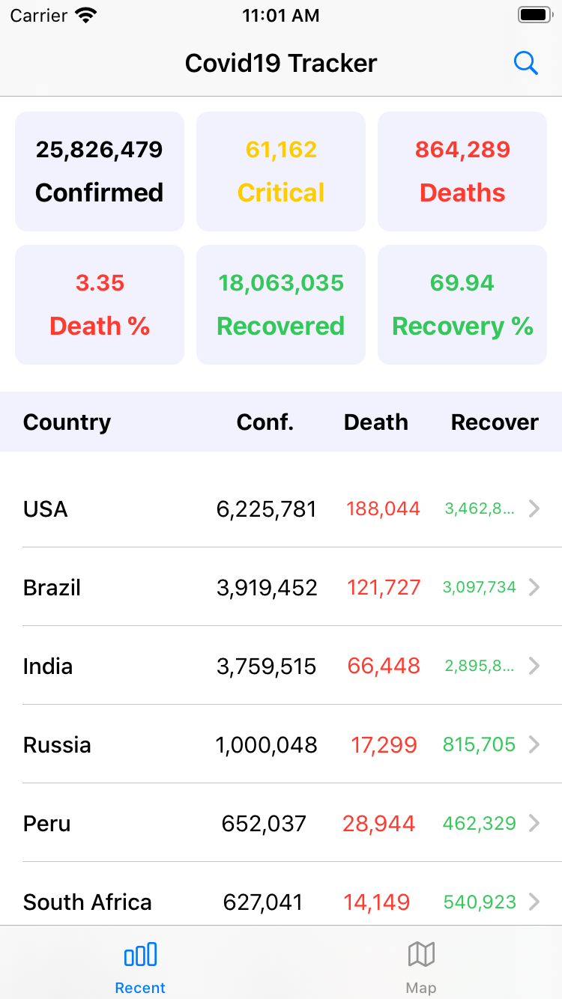
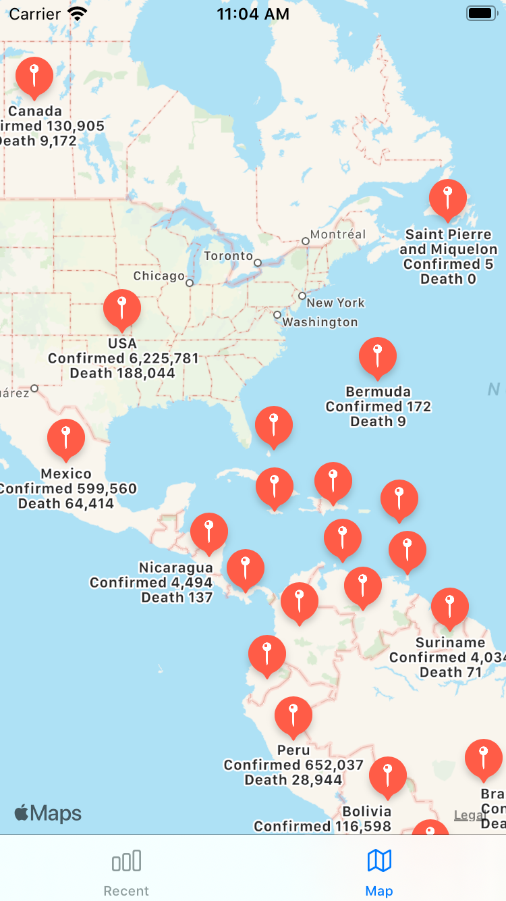
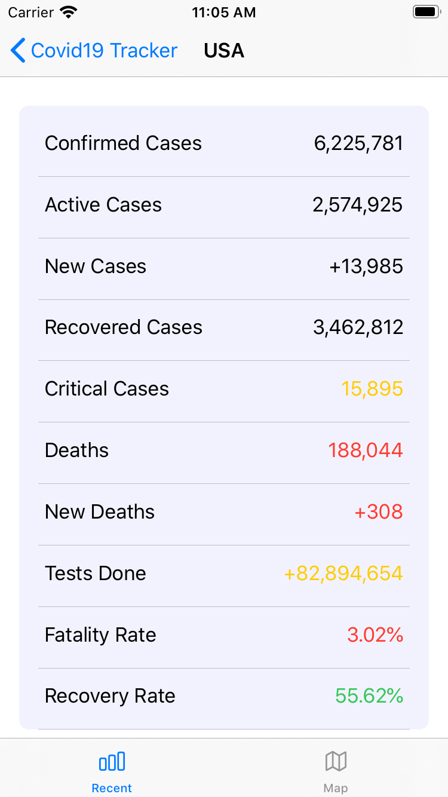

# Covid19-Tracking-iOS-App
A Swift-Based Real-time COVID-19 Statistic iOS Application

## Demo

  
  
  

## Features
* Real-time COVID-19 Statistic
* Live Map

## Skills
* Swift
* SwiftUI
* UIKit
* CocoaPods
